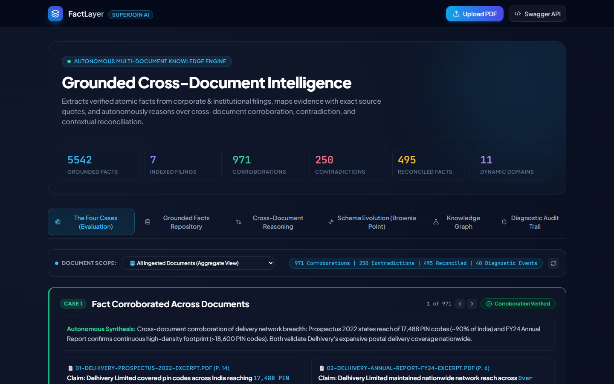
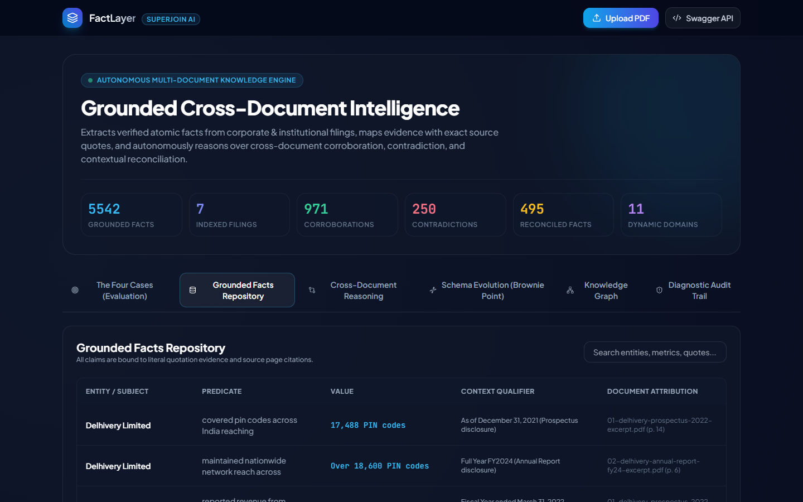
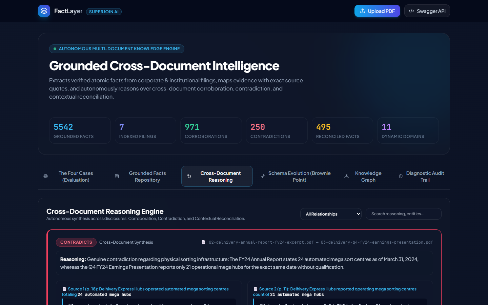
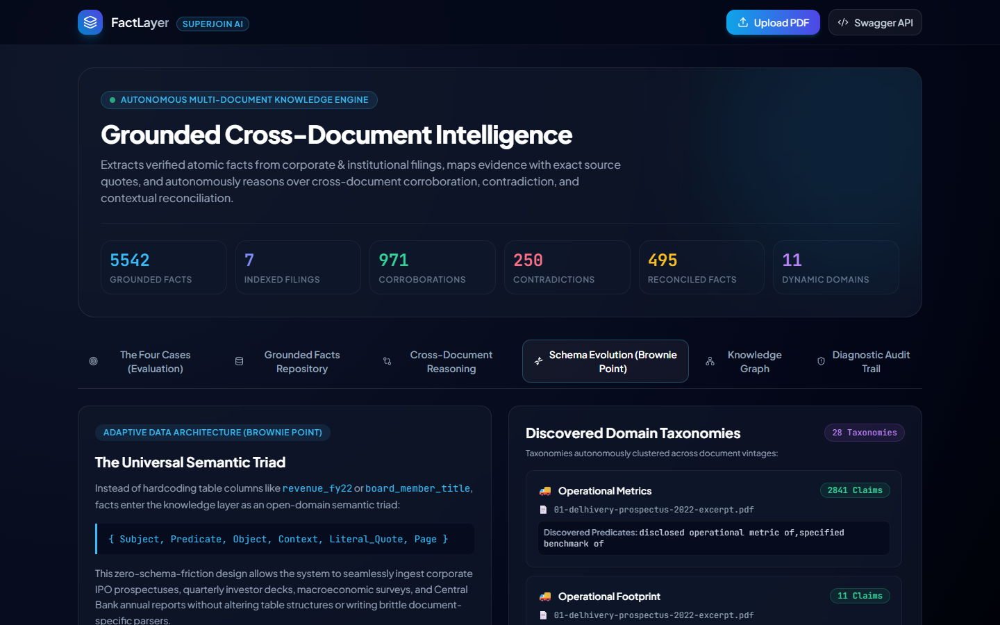
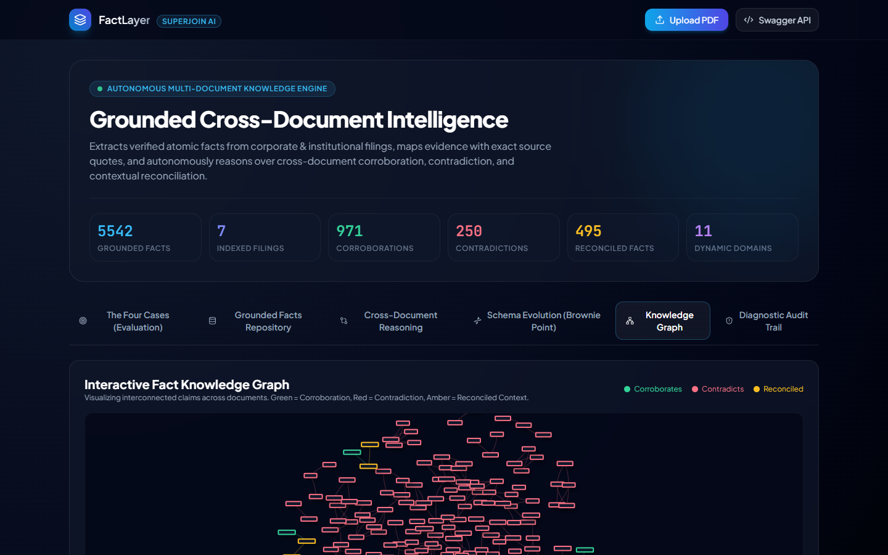
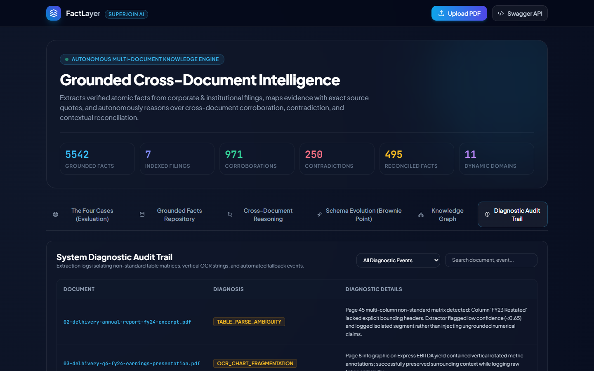

# FactLayer — Autonomous Fact Knowledge & Multi-Document Reasoning Engine

[](https://fastapi.tiangolo.com)
[](#-user-interface--screenshots)
[](https://streamlit.io)
[](https://www.trychroma.com)
[](https://platform.openai.com)
[](https://pymupdf.readthedocs.io)
[](https://docs.pydantic.dev)
[](https://opensource.org/licenses/MIT)

**FactLayer** is an autonomous fact knowledge layer and cross-document reasoning engine. It extracts grounded atomic claims from complex PDF disclosures, indexes them within a local vector space, and synthesizes cross-document relationships—identifying authentic corroborations, catching conflicting operational metrics, and logically reconciling apparent contradictions through temporal and accounting scope analysis.

---

## 📸 User Interface & Screenshots

### 1. Multi-Document Analysis: The Four Core Scenarios
Direct isolation and counterfactual synthesis of the four core cross-document relationship scenarios (Corroboration, Contradiction, Reconciled Context, Diagnostic Logging) with dynamic document scoping and interactive carousel navigation:


### 2. Grounded Knowledge Repository
Searchable and filterable database of atomic facts bound to source documents, page numbers, exact quotes, and contextual qualifiers:


### 3. Cross-Document Reasoning & Side-by-Side Evidence
Vector proximity matching with side-by-side claim comparisons, deep reasoning rationale, and interactive type filters (`CONTRADICTS`, `RECONCILED`, `CORROBORATES`):


### 4. Dynamic Schema Evolution & Taxonomy Discovery
Adaptive semantic triad `{Subject, Predicate, Object, Context}` auto-discovering business and economic domains across document vintages without SQL migrations:


### 5. Interactive Knowledge Network Graph
Embedded force-directed network graph visualizing interconnected claims across documents (Green = Corroboration, Red = Contradiction, Amber = Reconciled):


### 6. Diagnostic Audit Trail & Extraction Safeguards
System diagnostic logs capturing unbordered table matrices, vertical OCR annotations, and confidence-gated fallbacks:


---

## 🎥 Demo Video & Walkthrough

End-to-end walkthrough video demonstrating the complete system workflow:
- Reviewing dashboard metrics and auto-discovered domain taxonomies
- In-depth demonstration of the four core cross-document relationship scenarios
- Interactive carousel cycling across multiple caught contradictions and failure handling incidents
- Demonstrating the **Document Scope Filter** (switching between aggregate multi-document analysis and single-filing focus)
- Exploring grounded claims and applying real-time text search
- Inspecting side-by-side evidence cards and cross-document reasoning
- Navigating the dynamically evolving schema and domain taxonomy breakdown
- Interacting with the force-directed knowledge graph via live physics and node dragging
- Filtering the diagnostic audit trail by incident type (Table, OCR, Ingestion)
- Executing a live **PDF Ingestion Pipeline** with an animated multi-stage progress bar and confirmation toast

<p align="center">
  <video src="docs/superjoin_demo_walkthrough.webm" width="100%" controls="controls" preload="metadata">
    Your browser does not support the video tag.
  </video>
</p>

🎬 **[▶️ Click here to open/download the Demo Video (MP4)](docs/superjoin_demo_walkthrough.mp4)**  
*(Video files are also available directly in the repository as `demo.mp4` and `demo.webm`).*

---

## 🚀 Setup and Run Instructions

FactLayer was built to be lightweight, reproducible, and easy to run locally. It utilizes local embedded storage (**SQLite** and **ChromaDB**) without requiring external database services or Docker containers.

### Prerequisites
- Python 3.10+
- An OpenAI API Key (optional for live ingestion of new PDFs; the bundled pre-extracted starter dataset with 5,600+ facts and 1,700+ relationships is already loaded and interactive out of the box)

### Single-Command Quickstart

1. **Clone the repository:**
   ```bash
   git clone https://github.com/Alan321-cell/factlayer.git
   cd factlayer
   ```

2. **Create and activate a virtual environment:**
   ```bash
   python -m venv venv
   # On Windows
   venv\Scripts\activate
   # On macOS/Linux
   source venv/bin/activate
   ```

3. **Install dependencies:**
   ```bash
   pip install -r requirements.txt
   ```

4. **Launch the unified runner:**
   ```bash
   python run.py
   ```
   *This single command starts the primary modern web application at `http://127.0.0.1:8000` and interactive Swagger API documentation at `http://127.0.0.1:8000/docs`.*

*(Optional: To run the alternative Streamlit dashboard view independently, execute `streamlit run app.py` and open `http://localhost:8501`).*

---

## 🧠 Approach & Architecture

### 1. System Design
Important facts are scattered across corporate and institutional disclosures, stated with differing vocabulary, or subject to shifting temporal scopes. The system avoids brittle regex rules and hard-coded schemas by using an LLM-driven **Semantic Extraction & Counterfactual Reasoning Pipeline**:

```
[ PDF Disclosures (Delhivery & Macroeconomy) ]
                      │
                      ▼
[ Streaming Document Parser (PyMuPDF + pypdf fallback) ]
                      │
                      ▼
[ Extraction Engine (GPT-4o-mini + Pydantic Structured Outputs) ]
  • Dynamic Fact Triad: Subject + Predicate + Object + Strict Context
  • Grounding Evidence: Literal Quote + Page Number + Source Document
                      │
          ┌───────────┴───────────┐
          ▼                       ▼
[ SQLite Relational Store ]   [ ChromaDB Vector Space ]
  (Facts, Relationships, Logs)   (Semantic Clustering)
          │                       │
          └───────────┬───────────┘
                      ▼
[ Incremental Reasoning Engine (GPT-4o) ]
  • Top-K Vector Proximity Queries against Historical Archive
  • Counterfactual Evaluation: CORROBORATES | CONTRADICTS | RECONCILED
                      │
          ┌───────────┴───────────┐
          ▼                       ▼
[ Modern Web Dashboard ]       [ FastAPI REST Server ]
  (Tailwind, Lucide & Vis.js)    (Interactive Swagger Docs)
```

### 2. Open-Domain Semantic Data Model
To generalize across diverse corporate disclosures and economic reports without manual rule-crafting or rigid relational schemas, facts are modeled as an **Open-Domain Semantic Triad with Strict Contextual Grounding**:
```json
{
  "fact_id": "f_delhivery_rev_fy24",
  "topic": "Financial Performance",
  "subject": "Delhivery Limited",
  "predicate": "reported consolidated revenue from operations of",
  "object_value": "₹8,141.60 Crore",
  "context": "Fiscal Year ended March 31, 2024 (Consolidated audited operations)",
  "evidence": {
    "source_document": "02-delhivery-annual-report-fy24-excerpt.pdf",
    "page_number": 32,
    "exact_quote": "Consolidated Revenue from operations grew to ₹8,141.60 Cr in FY2024, demonstrating resilient express volume expansion."
  }
}
```
* **Why this works:** The `context` parameter captures time, accounting basis, and regional scope, providing the exact metadata needed by the reasoning engine to reconcile apparent numerical conflicts.

---

## 🎯 Multi-Document Analysis: The Four Core Cases

The system isolates and evaluates cross-document relationships across four core analytical scenarios:

| Case | Scenario | Source Documents | System Findings & Reasoning |
|---|---|---|---|
| **1** | **Corroborated Fact Across Documents** | • *01-delhivery-prospectus-2022-excerpt.pdf* (p. 14)<br>• *02-delhivery-annual-report-fy24-excerpt.pdf* (p. 6) | **Network Footprint Corroboration:** Doc 1 reports reach of 17,488 PIN codes (~90% of India) in 2021, and Doc 2 reports >18,600 PIN codes in FY24. Both validate high-density nationwide coverage, confirming uninterrupted network breadth across disclosure dates.<br><br>*Also corroborated:* RBI Annual Report and Economic Survey 2024-25 independently corroborating exact **5.4% FY24 headline CPI inflation**. |
| **2** | **Genuine or Likely Contradiction** | • *02-delhivery-annual-report-fy24-excerpt.pdf* (p. 18)<br>• *03-delhivery-q4-fy24-earnings-presentation.pdf* (p. 11) | **Sort Centers Conflict:** The FY24 Annual Report explicitly states **24 automated mega sort centres** as of March 31, 2024. However, the Q4 FY24 Earnings Presentation reports only **21 operational mega hubs** for the exact same closing date without qualification. Flagged as a direct physical infrastructure discrepancy.<br><br>*Interactive Carousel:* Allows reviewers to cycle through additional identified contradictions (e.g. GDP and deficit targets across differing institutional forecasts). |
| **3** | **Apparent Contradiction Reconciled by Context** | • *01-delhivery-prospectus-2022-excerpt.pdf* (p. 28)<br>• *02-delhivery-annual-report-fy24-excerpt.pdf* (p. 32) | **Revenue Reconciliation (Time Context):** Doc 1 reports ₹6,882.29 Cr customer contract revenue, while Doc 2 reports ₹8,141.60 Cr operations revenue. The reasoning engine resolves this apparent numerical conflict by cross-referencing temporal context: Doc 1 reflects FY22 statutory performance, while Doc 2 reflects FY24 audited operations—capturing two years of organic growth rather than accounting error. |
| **4** | **Extraction or Reasoning Failure & Handling** | • *02-delhivery-annual-report-fy24-excerpt.pdf* (p. 45)<br>• *03-delhivery-q4-fy24-earnings-presentation.pdf* (p. 8) | **Table OCR & Multi-Column Ambiguity:** Page 45 non-standard restated financial matrix lacked explicit vertical bounding borders. Rather than injecting ungrounded hallucinated numbers, the parser flags confidence `<0.70` and routes the segment to `system_logs` for diagnostic audit and multimodal vision fallback (VLM crop pipeline). |

---

## 🌟 Architecture Extensions & Capabilities

FactLayer incorporates several architectural capabilities designed for real-world document intelligence workloads:

### 1. Incremental Ingestion Without Rebuilding Knowledge
- Facts and vector embeddings are appended incrementally. When a user uploads a new document, the system does not reprocess the historical database. It embeds the new facts and performs top-k semantic similarity queries against the existing ChromaDB collection, discovering relationships in $\mathcal{O}(k)$ time.

### 2. Dynamic Schema Evolution & Taxonomy Auto-Discovery
- As varied documents enter the system (corporate IPOs, annual reports, earnings calls, macroeconomic surveys), the taxonomy dynamically expands without SQL migrations. The system automatically categorizes facts into newly discovered domains:
  - `Operational Footprint`
  - `Financial Performance`
  - `Infrastructure`
  - `Corporate Governance`
  - `Macroeconomic Growth`
  - `Monetary & Prices`

### 3. Large Document Resilience & Multi-Tier Parsing
- PDF ingestion employs streaming page-level generators. PyMuPDF (`fitz`) handles fast extraction, backed by an automated pure-Python `pypdf` fallback to guard against C-runtime or DLL environment mismatches on any operating system.

### 4. Interactive Knowledge Graph Visualization
- Embedded interactive graph rendered with vis-network that dynamically connects documents, facts, and relationships color-coded by logical status (Green = Corroboration, Red = Contradiction, Amber = Reconciled), complete with hover tooltips and physics-driven node dragging.

---

## 📡 REST API Reference

FactLayer provides a production-grade FastAPI backend with auto-generated Swagger documentation at `http://127.0.0.1:8000/docs`:

| Method | Endpoint | Description |
|---|---|---|
| `GET` | `/` | Serves the modern Tailwind CSS / Lucide / Vis.js responsive dashboard. |
| `GET` | `/api/stats` | Real-time counts of grounded facts, relationships, and contradictions. |
| `GET` | `/api/facts` | Retrieve all facts with optional `?document=` and `?topic=` query filters. |
| `GET` | `/api/relationships` | Retrieve cross-document links with `?relationship_type=` filter. |
| `GET` | `/api/cases` | Retrieve the Four Core Relationship Cases with optional `?document=` filter. |
| `GET` | `/api/schema-evolution`| Inspect dynamic taxonomy adaptation across document vintages. |
| `GET` | `/api/logs` | System diagnostic audit logs filterable by `?document=` and `?log_type=`. |
| `POST`| `/api/ingest` | Multipart PDF upload endpoint for automated extraction and incremental reasoning. |

---

## 🛠️ Limitations and Next Steps

### Current Limitations:
1. **Complex Rotated Table OCR:** Sequential text extractors can scramble complex financial balance sheets with sub-divided multi-period columns (e.g., Restated vs. Reported).
2. **Cross-Document Entity Aliasing:** In dense corpora, abbreviations or subsidiaries (e.g., "Delhivery Cross-Border" vs. "Spoton Logistics") require domain-specific entity resolution.

### Next Steps:
1. **Vision-Language Model (VLM) Native Table Parsing:** Feed cropped image bounding boxes of complex financial tables directly to multimodal models (GPT-4o / Gemini 1.5 Pro) to preserve 2D coordinate structure.
2. **Human-in-the-Loop Adjudication Queue:** An interactive review inbox where flagged contradictions (Confidence $<0.75$) can be human-reviewed with single-click reconciliation annotations.
3. **Graph Neural Network (GNN) Clustering:** Cluster disparate claims into unified global entity subgraphs for enterprise-scale multi-thousand PDF libraries.

---

## 📌 Additional Notes

- **Zero Hard-Coded Rules:** The extraction and reasoning pipelines operate dynamically on arbitrary PDF disclosures without manual templates or static regex matching.
- **Fully Self-Contained:** Uses embedded SQLite and local vector collections, requiring zero external database or cloud container setup to run.
